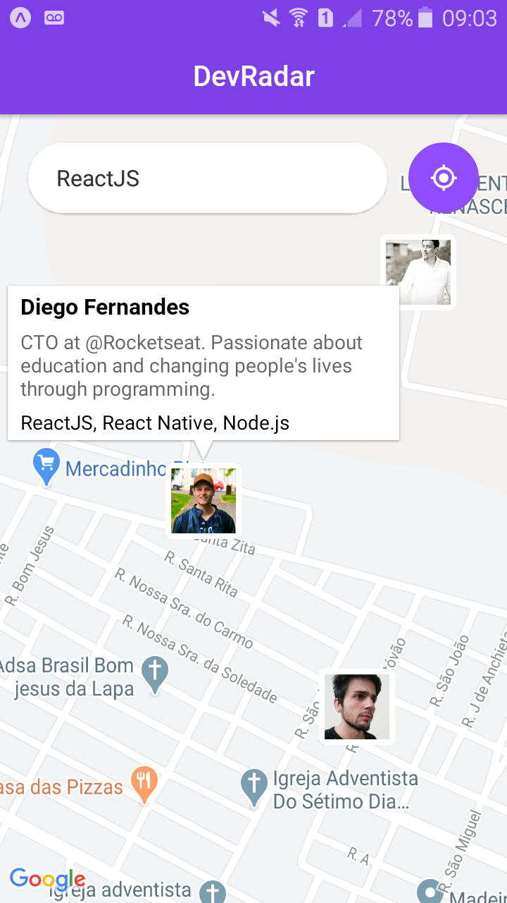

# Omnistack10
 Aplicação desenvolvida seguindo o evento Semana Omnistack 10 da Rocketseat com foco em Node.js, ReactJS e React Native.
 O DevRadar é um projeto que visa facilitar o contato entre desenvolvedores próximos a você e que utilizam as mesmas tecnologias. A aplicação web realiza o cadastro de desenvolvedores a partir do nome de usuário do github, tecnologias e localização geográfica. O app mobile detecta sua localização geográfica e exibe um mapa onde é possível fazer a buscar desenvolvedores por tecnologia dentro de um raio de 10KM da sua localização atual.

  

  

# Funcionalidades
 - Cadastro de devs em banco de dados não relacional
 - Listagem de devs cadastrados em tempo real
 - Detectar localização geográfica atual
 - Verifição de usuários cadastrados dentro de um raio de 10KM a partir da posição atual.

# Principais Tecnologias
 - Node.js
 - ReactJS
 - React Native
 - Expo
 - Socket.io
 - MongoDB